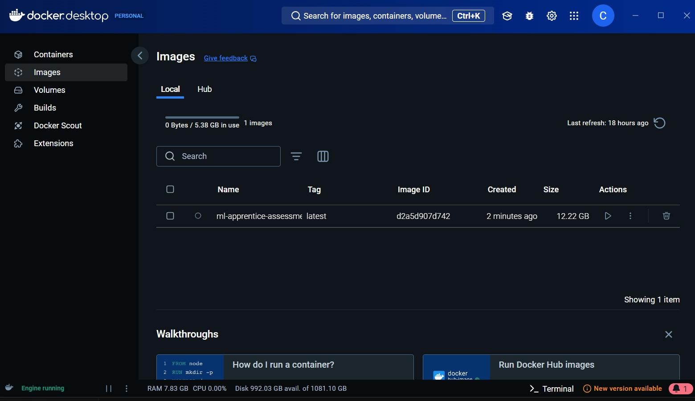
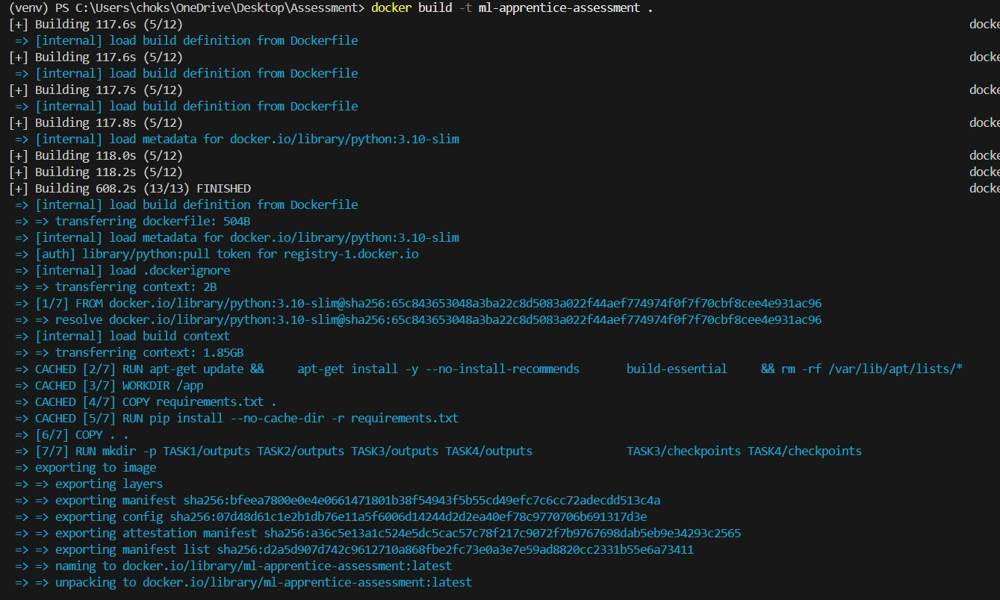
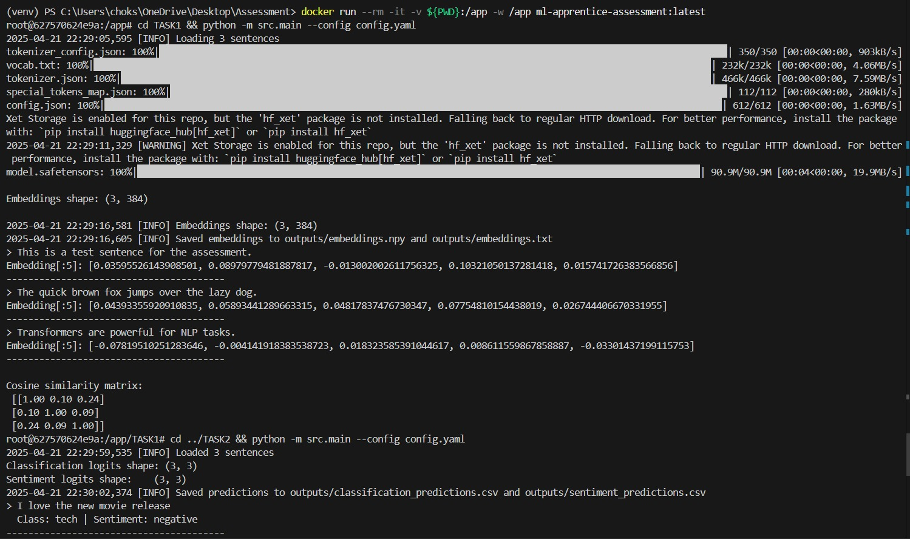
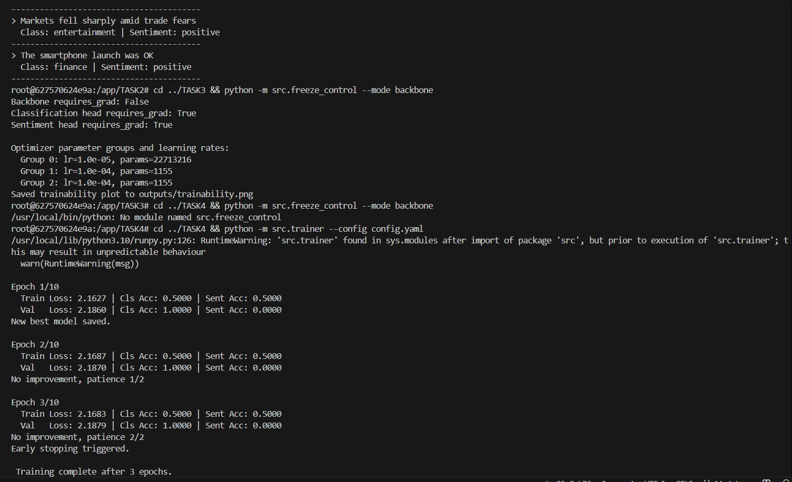
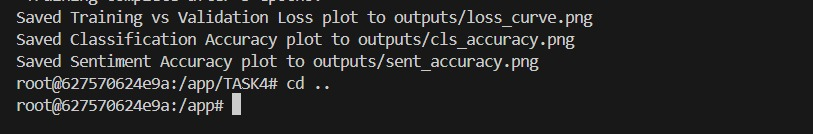

# ML Apprentice Take‑Home Assessment

*This repository contains my solutions for the four‑part take‑home exercise on Sentence Transformers and Multi‑Task Learning. Each task lives in its own folder with its own README and can be run locally or inside the provided Docker container.*

## **Project Structure**

ASSESSMENT/\
├── TASK1/ \
├── TASK2/\
├── TASK3/\
├── TASK4/\
├── docker-compose.yml/\
├── Dockerfile\
├── README.md \
└── requirements.txt 

## **Prerequisites**

- Python 3.8+ (3.10 recommended)  
- pip  
- Docker & Docker Compose (for containerized reproduction)


## **Running locally**

```
   git clone <this-repo>
   cd <this-repo>
```
```
    pip install virtualenv
    virtual venv
    .\venv\Scripts\activate 
```
```   
   pip install --upgrade pip
   pip install -r requirements.txt
```

## **TASK 1**

    ```bash
    cd TASK1
    python -m src.main --config config.yaml
    pytest -q tests
    ```

*To run CLS‑pooling version: in the config.yaml file, change the pooling to cls and run the commands given above*

## **TASK 2**

    ```
    cd ../TASK2
    python -m src.main --config config.yaml
    pytest -q tests
    ```

## **TASK 3**

    ```
    cd ../TASK3
    python -m src.freeze_control --mode backbone
    ```
*try other modes: all, cls_head, sent_head by modifying the config.yaml file*

## **TASK 4**

    ```
    cd ../TASK4
    python -m src.trainer --config config.yaml
    ```

*All outputs (embeddings, CSVs, plots, checkpoints) will be written under each outputs/ folder in the respective task folders*

## **Running with Docker**

**Everything is containerized for maximum reproducibility:**

1. Build the image

```
docker build -t ml-apprentice-assessment .
```

2. Launch an interactive shell

```
docker run --rm -it -v ${PWD}:/app -w /app ml-apprentice-assessment:latest 
```

3. Inside the container, execute each task exactly as shown above (cd TASK1, etc.).

4. Exit from the container

```
Exit
```

<p float="left">
  
   
   
  
  
</p>


## **Final Note**

**All work is done strictly according to the instructions in the provided PDF, using only small example datasets for demonstration. No large external datasets were used. Everything is tested, documented, and fully reproducible both locally and in Docker.**


*Feel free to explore each TASK*/README_task*.md for in‑depth details. Thank you for reviewing!*

