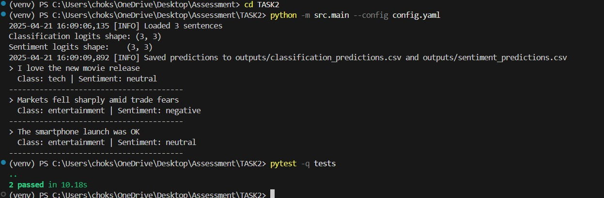

# **Task 2: Multi-Task Learning Expansion**

## **Objective**
Expand the existing sentence transformer architecture to support multi-task learning, demonstrating inference on two tasks simultaneously:

  1. Task A: Sentence classification (e.g., classifying topics like "entertainment," "finance," "tech").
  2. Task B: Sentiment analysis (e.g., classifying sentiment as "positive," "neutral," or "negative").

## **Overview**
In Task 2, I extended the single-task sentence transformer developed in Task 1 into a multi-task model. The core idea was to leverage a shared transformer backbone (sentence-transformers/all-MiniLM-L6-v2) and add two separate classification heads:

	1. ClassificationHead: Predicts the sentence topic (Task A).

	2. SentimentHead: Predicts the sentiment of the sentence (Task B). 

*Both heads operate concurrently, providing predictions for both tasks in a single forward pass, showcasing efficiency and modularity.*

## **Project Structure**

TASK2/\
├── config.yaml \
├── data/\
│   └── sample_task2.csv\
├── outputs/\
│   ├── classification_predictions.csv\
│   ├── sentiment_predictions.csv\
├── src/\
│   ├── __init__.py\
│   ├── multitask_encoder.py\
│   ├── main.py\
│   └── utils.py\
├── tests/\
│   ├── test_multitask_encoder.py\
│   └── test_main.py\
└── README_TASK2.md \

## **Setup and Execution**

### 1. Execution

    ```
    python -m src.main --config config.yaml
    ```

### 2. Modifications (config.yaml)

``` 
model:
  name: sentence-transformers/all-MiniLM-L6-v2
  pooling: mean
  normalize: true

tasks:
  classification:
    labels: ["entertainment", "finance", "tech"]
  sentiment:
    labels: ["negative", "neutral", "positive"]

inference:
  batch_size: 16

data:
  sample_file: data/sample_task2.csv

output:
  classification_predictions: outputs/classification_predictions.csv
  sentiment_predictions: outputs/sentiment_predictions.csv
 ```

### 4. Tests

```
pytest -q -s
```
They are done to ensure:
  1. Correct shapes of outputs from the multi-task heads.
  2. CLI-based inference generates required output files.


### 5. Results

  1. Outputs generated in the terminal:
  2. Outputs saved in the csv:



### 6. Architecture (Multitask Learning)
    1. Shared Backbone 
      - Leveraged sentence-transformers/all-MiniLM-L6-v2 as a common backbone, providing a shared representation for all tasks.
    2. Multiple Task-Specific Heads
      - Classification Head: Linear layer mapping the transformer output to sentence classes (Task A).
      - Sentiment Head: Linear layer mapping the transformer output to sentiment categories (Task B).
    3. Joint Forward Pass
      - A single forward pass produces embeddings, fed into both task-specific heads simultaneously.
      - Efficient computation with shared parameters while maintaining task-specific learning capability.
    4. Configurable Design
      - Tasks and labels are defined in a YAML configuration file (config.yaml), making it easy to update or add new tasks without altering the core codebase.


*All tasks have been completed per the assessment instructions, with functionality demonstrated on a small example dataset as specified with more focus on the overall working, the output generated is just to show the working of the model*