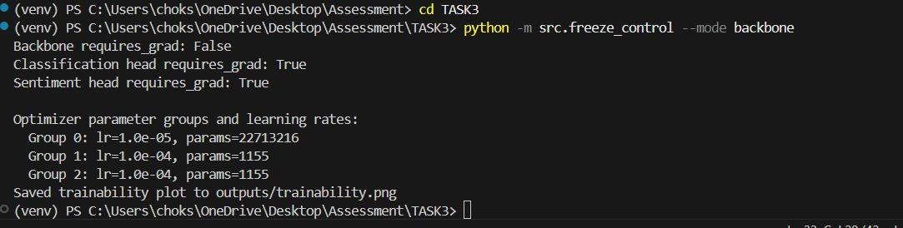

# Task 3: Training Considerations

## 1. Freeze Scenarios Analysis

### 1.1 Entire Network Frozen
- **What it means:**
  All parameters (transformer backbone and both heads) are frozen. The model is purely a feature extractor.
- **When to use**  
  You treat the transformer + heads purely as a feature extractor; training happens downstream (e.g., classical classifiers on embeddings).
- **Pros:**  
  - No risk of catastrophic forgetting.  
  - Fast inference with minimal GPU/memory footprint.  
  - Stable, predictable embeddings across tasks.
- **Cons:**  
  - No adaptation to domain/task specifics.  
  - Cannot correct misaligned features.

### 1.2 Only Transformer Backbone Frozen
- **What it means:**
  The transformer backbone remains fixed, while both task-specific heads are trainable. 
- **When to use**  
  You trust pretrained features and leverage it to balance rapid fine-tuning and want to train task‑specific heads.
- **Pros:**  
  - Heads learn fast with few parameters.  
  - Leverages robust pretrained language understanding from transformer. 
  - Lower GPU footprint than full fine‑tuning.
- **Cons:**  
  - Backbone won't learn specialized domain-specific patterns beyond pretrained knowledge.
  - May underperform if pretrained domain diverges.

### 1.3 Only One Task Head Frozen
- **What it means:**
  You freeze either the classification or sentiment head, allowing backbone and the other head to update during training. 
- **When to use**  
  You have one task that’s already well‑trained, and wish to adapt the rest of the model (backbone + other head) without disturbing it.
- **Pros:**  
  - Preserves a previously well-trained task head while fine-tuning backbone and the other head.  
  - Useful when one task is stable and another requires further training.
- **Cons:**  
  - Risk of new task gradients “leaking” into backbone, indirectly affecting frozen head behavior.

---

## 2. Transfer Learning Strategy

Transfer learning involves fine-tuning pretrained models for new, specific tasks. Here is a detailed breakdown of how I’d approach the transfer learning process:

### 2.1 Choice of Pretrained Model
- **Default:** `all‑MiniLM‑L6‑v2` (Compact, efficient, highly performant general-purpose model.)
- **Specialized domains:**  
  - **Finance:** `ProsusAI/finbert`  
  - **Biomedical:** `dmis-lab/biobert-v1.1`  
  Domain-specific models improve performance on specialized text by providing pretrained embeddings aligned closely with the vocabulary and semantics of the target domain.

### 2.2 Layers to Freeze/Unfreeze
I recommend a gradual, phased fine-tuning approach:
- **Initial phase:**  
  - Freeze bottom transformer layers: Retain general syntactic/grammatical knowledge. 
  - Unfreeze only top 2–4 transformer layers: Allow subtle semantic adjustments.
  - Fully train heads (classification & sentiment): Ensure precise task alignment.
- **Second phase (If Sufficient Data Available):**  
  - Gradual unfreezing: Progressively unfreeze middle transformer layers if performance plateaus.  
  - Layer-wise learning rate decay: Higher learning rates for upper layers; lower rates for lower layers.

Optimizer setup:

```
optimizer = AdamW([
    {"params": model.backbone.parameters(),          "lr": 1e-5},
    {"params": model.classification_head.parameters(), "lr": 1e-4},
    {"params": model.sentiment_head.parameters(),     "lr": 1e-4},
], weight_decay=0.01)
```

1. *Lower transformer layers encode universal linguistic features, so minimal training helps avoid catastrophic forgetting.*
2. *Upper transformer layers encode task-specific semantics, thus benefit from fine-tuning.*


### 2.3 Rationale Behind These Choices
- **The overall rationale behind the recommended freeze and fine-tune strategy is:**  
  - **Preserving general knowledge:** 
    1. Early transformer layers capture language syntax and structure—often universal across tasks/domains.
    2. Avoid retraining these heavily to prevent forgetting foundational language knowledge.
  - **Focusing domain/task-specific knowledge:**
    1. Later transformer layers are adapted to specific semantic nuances relevant to the new tasks.
    2. Task-specific heads quickly learn distinctions essential for classification or sentiment analysis.
  - **Efficiency and stability:**
    1. Small learning rates and gradual unfreezing help stable convergence.
    2. Layer-wise learning rate scheduling balances efficient training with effective adaptation.
---

## 3. Summary of Key Decisions
1. **Freeze backbone** for small data scenarios to train only heads.  
2. **Partial unfreeze** for domain shift to adapt semantics without disrupting syntax.  
3. **Gradual unfreeze & LR scheduling** for stable, efficient fine‑tuning.

## 4. For working with larger datasets:
  1. **Layer-wise Unfreezing:**
    - Gradually unfreeze backbone layers starting from top layers downwards if validation accuracy plateaus, enabling deeper adaptation while protecting the model from catastrophic forgetting.
  2. **Adaptive LR Schedules:**
    - Use differential learning rates smaller for the backbone, larger for heads to maintain stable and effective training.

*Example:*
```
optimizer = AdamW([
    {"params": model.backbone.encoder.layer[:8].parameters(), "lr": 1e-6},
    {"params": model.backbone.encoder.layer[8:].parameters(), "lr": 5e-6},
    {"params": model.classification_head.parameters(),        "lr": 1e-4},
    {"params": model.sentiment_head.parameters(),             "lr": 1e-4},
], weight_decay=0.01)
```

## 5. Result:


