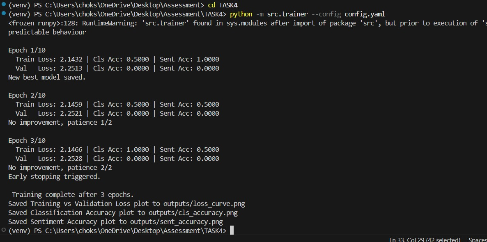

# Task 4: Training Loop Implementation

This document provides a comprehensive overview and explanation of the multi-task training loop implementation for the sentence transformer extended in Task 2. The implementation includes handling hypothetical data, executing forward and backward passes, calculating metrics, checkpointing the best model, early stopping, and visualization of the training dynamics.

## 1. Handling Hypothetical Data

- I reused the same CSV format as Task 2 (`sentence,class_label,sentiment_label`).
- `Task2Dataset` in `utils.py` reads sentences and label IDs into memory.
- A PyTorch `DataLoader` batches and shuffles data, using a custom `collate_fn` to return:
  - `List[str]` of sentences
  - `Tensor` of class labels
  - `Tensor` of sentiment labels
- Minimal dataset used to demonstrate functionality and correctness.
- Dataset split into training and validation sets based on the val_split ratio.

## 2. Forward Pass

1. **Tokenization**  
   - Batches of sentences are tokenized with padding and truncation to uniform length.
   - Sent to the same device as the model.

2. **Backbone Encoding**  
   - The transformer model returns `last_hidden_state`: `(batch, seq_len, hidden_dim)`.

3. **Pooling**  
   - **CLS pooling**: take `[CLS]` token representation.  
   - **Mean pooling**: average token embeddings, masking out padded positions.

4. **Normalization (Optional)**  
   - If enabled, apply L2 normalization to pooled vectors.

5. **Task Heads**  
   - A linear layer for classification: `(batch, hidden_dim) → (batch, num_classes)`.  
   - A linear layer for sentiment: `(batch, hidden_dim) → (batch, num_sentiments)`.

## 3. Loss & Metrics

- **Loss Calculation**:
   - Individual cross-entropy losses calculated for classification and sentiment predictions.
   - Losses combined according to configurable task-specific weights.

- **Metrics Computed:**
   - Loss per epoch (train and validation).
   - Accuracy per task (classification and sentiment) for each epoch.

- **Backward Pass and Optimization:**
   - AdamW optimizer employed.
   - Differential learning rates used:
      - Lower rate (1e-5) for pre-trained backbone.
      - Higher rate (1e-4) for newly initialized heads.
   - Linear warmup learning rate scheduler implemented.

- **Checkpointing and Early Stopping:**
   - Checkpoints (best_epoch_X.pt) saved whenever validation loss improves.
   - Early stopping triggered after consecutive epochs with no improvement (patience = 2 epochs).

